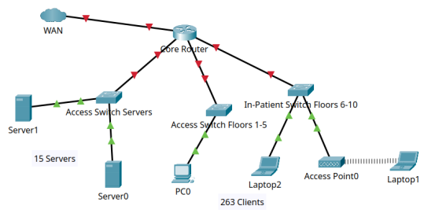
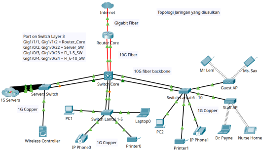

# Healing a Broken Network

## Overview
This project is an enterprise network modernization case study for Harshborough hospital, a 10-floor medical facility with 263 clients and 15 servers experiencing critical infrastructure limitations. The existing network relied on a single flat-topology router handling all internal and WAN traffic, with no segmentation, no redundancy, and inefficient use of public IP addressing. This project proposes and simulates a complete network redesign using Cisco Packet Tracer, covering hierarchical architecture, VLAN segmentation, VoIP, WLAN, routing, NAT/PAT, and access control, treated not as an academic exercise, but as a real enterprise architecture proposal.

## The Problem
Harsborough hospital's existing network suffered from several fundamental design flaws that directly threatened operational continuity in a healthcare environment where network downtime is not an option. The entire network was built around a single core router handling both internal routing and WAN connectivity, meaning all inter-floor traffic, server access, and internet requests were funneled through one device, creating a severe bottleneck that worsened as hospital digital services expanded.

Beyond the centralized bottleneck, the network had no redundancy at any layer. A single link connected each floor to the core router, meaning any link failure would completely isolate the affected floor from the rest of the network including access to electronic health records, radiology systems, and patient information. This level of single point of failure is unacceptable in a clinical environment where delayed access to patient data carries direct consequences for patient safety.

The IP addressing scheme compounded the problem further. Every floor was assigned a full public class C block of 254 addresses despite actual device counts ranging from 14 to 43 per floor, resulting in an effective utilization rate of only 10.9% accross 2,540 allocated addresses for 278 actual devices. The use of public IP addresses for internal devices also created unnecessary dependency on ISP-rented address blocks, driving up operational costs without any technical justification. Finally, that flat per-floor segmentation provided no functional isolation between servers, clinical devices, staff workstations, and wireless clients, making access control, QoS enforcement, and security policy implementation effectively impossible.

## Proposed Architecture
The proposed architecture replaces the flat single-route topology with a two-tier hierarchical design consisting of a core/distribution layer and an access layer, built around the principle that routing complexity should be handled at the center while the edges remain simple and consistent. A Cisco 2811 router sits at the top of the hierarchy as the exclusive WAN gatway, handling NAT/PAT and ISP connectivity without any involvement in internal routing decisions. Below it, a Cisco 3650-24PS Layer 3 switch servers as the core/distribution layer, taking full ownership of inter-VLAN routing via Switch Virtual Interfaces and running single-area OSPF with the router for dynamic route exchange.

Three access switches sit at the bottom of the hierarchy, each serving a dedicated segment of the network. The Servers Switch connects the 15-server data center clust along with the dedicated DHCP server and Network Controller. The Floor 1 to 5 Switch serves administrative and operational staff with wired access and VoIP. The Floor 6 to 10 Switch serves the inpatient department with clinical workstations, IP phones, and wireless access point for staff and guest WLAN coverage. All backbone connections between the core switch and access switch use redundant gigabit uplinks managed by Spanning Tree Protocol, providing automatic failover in the event of a link failure without manual intervention.

The router is deliberately kept out of internal routing decisions. All inter-VLAN traffic is handled locally by the Layer 3 switch, meaning clinical staff accessing electronic health records, radiology systems, or patient information never experience the latency of traversing a WAN-edge device for internal requests. The router only processes traffic that is genuinely destined for the internet, which is then translated via PAT to a single public IP address before leaving the network, eliminating the need for multiple rented public address blocks from the ISP.

## Key Design Decisions
__Keeping OSPF Instead of Replacing It__ <br>
The original case brief expressed a desire to move away from OSPF toward something easier to manage, After analysis, the conclusion was that OSPF itself was never the problem. THe real source of operational complexity was the flat topology forcing all routing through a single device without hierarchy. Rather than introducing a new protocol and its associated learning curve, the architecture was redesign around OSPF so that it runs only between the router and the core Layer 3 switch in a single-area configuration. Single-area OSPF is significantly easier to configure, troubleshoot and maintain compared to multi-area OSPF, and it is more than sufficient for a network of this scale. The result is that OSPF become simpler to manage not by replacement but by giving it a better environment to operate in

__Function-Based VLAN Segmentation instead of Floor-Based__ <br>
The original network segmented by floor location, which seems intuitive but falls in a hospital environment where clinical staff move constantly between floors and need consistent network access regardless of physical location. The proposed design segments by function instead, meaning a doctor connecting from floor 6 to floor 9 lands on the same Staff WLAN VLAN with the same access rights, the same QoS policy, and the same ACL enforcement. This approach also makes security policy significantly cleaner because each VLAN represents a homogeneous group of devices with identical access requirements, making ACL rules precise and auditable rather than broad and approximate.

__RFC1918 Private Addressing with VLSM__ <br>
Replacing 10 rented public Class C blocks with a single private 172.16.0.0/16 block eliminate ISP depedency for internal addressing entirely. VLSM allows each subnet to be sized proportionally to its actual host count while maintaining a reasonable growth buffer, replacing a 10.9% utilization rate with a scheme where every address block serves a defined purpose. NAT/PAT at the router edge means only one public IP address is needed for all outbound internet traffic from 278 internal devices.

__Dedicated DHCP Server instead of Router or Switch__ <br>
An early design decision was to centralize DHCP on a dedicated server in VLAN 60 rather than running it on the router or the Layer 3 switch. In a healthcare environment, DHCP is a critical service because IP phones, wireless clients, and clinical devices all depend on it for connectivity. Hosting DHCP on dedicated server separates the service fro the network infrastructure, meaning a router restart or switch reload does not interrupt IP address assignment for active devices. In a production deployment this server would be paired with a secondary DHCP server for high availability, which was noted as a future consideration given Packet Tracer simulation constraints.

__Redundant Uplinks on All Backbone Connections__ <br>
Given that the original network had zero redundancy and that high availability was identified as non-negotiable business requirement, redundant uplinks were implemented on every backbone connection including router to core switch and core switch to each access switch. Spanning Tree Protocol manages the redundant paths by keeping one active and one in standby, with automatic failover if the primary link fails. This was treated as a core design requirement than an optional enhancement, reflecting the reality that in a clinical environment a network outage is an operational emergency.

## Technologies Used

| Category  | Technology |
| --------- | ---------- |
| Simulation | Cisco Packet Tracer |
| Routing Protocol | OSPF Single-Area |
| Switching | IEEE 802.1Q VLAN Trunking, Spanning Tree Protocol |
| IP Addressing | RFC1918 Private Addressing, VLSM |
| DHCP | Dedicated DHCP Server with DHCp Relay (ip helper-address) |
| Network Address Translation | NAT/PAT (PAT overload) |
| Wireless | WPA3 Enterprise 802.1X with RADIUS, Captive Portal |
| VoIP | Cisco Call Manager Express, DHCP Option 150 |
| Access Control | Extended Named ACL |
| Network Management | Centralized Network Controller, VLAN 70 Management Segment |
| Devices | Cisco 2811, Cisco 3650-24PS, Cisco 2960-24TT, Cisco IP Phone 7960, Access Point PT |

## Network Topology
The network topology is organized into three distinct functional segments connected through a hierarchical core, each serving a dedicated role in the overall architecture. The diagram below represent the proposed topology as simulated in Cisco Packet Tracer.

__Current Topology (Before)__ <br>
 <br>
The current topology shows all ten floor segments connecting directly to a single core router that simultaneously handles WAN connectivity, with no Layer 3 Switching, no redundancy, and no segmentation beyond per-floor subnets.

__Proposed Topology (After)__ <br>
 <br>
The proposed topology introduces a clear three-device hierarchy where the router handles only WAN and NAT/PAT, the Layer 3 switch handles all inter-VLAN routing and internal forwarding, and access switches serve their respective segments with redundant uplinks throughout the backbone. All port assignments and connection labels are documented directly on the topology diagram for clarity.

__Port Mapping Reference__ <br>

| Interface  | Device A | Device B |
| --------- | -------- | -------- |
| Gig1/1/1 and Gig1/1/2 | Switch Layer 3 | Router Core (redundant) |
| Gig1/0/2 and Gig 1/0/22 | Switch Layer 3 | Servers Switch (redundant) |
| Gig1/0/3 and Gig 1/0/23 | Switch Layer 3 | Switch Lantai 1-5 (redundant) |
| Gig1/0/4 and Gig 1/0/24 | Switch Layer 3 | Switch Lantai 6-10 (redundant) |
| Gig0/1 and Gig 0/2 | Servers Switch | Switch Layer 3 (uplink) |
| Gig0/1 and Gig 0/2 | Switch Lantai 1-5 | Switch Layer 3 (uplink) |
| Gig0/1 and Gig 0/2 | Switch Lantai 6-10 | Switch Layer 3 (uplink) |
| Fa0/0 | Router Core | Internet / WAN |

## VLAN Design & IP Addressing
The network migrates from ten public Class C blocks to single private 172.16.0.0/16 block segmented into seven function-based VLANs using VLSM. Each VLAN represents a homogeneous group of devices with identical access requirements, security policies, and traffic characteristics, making ACL enforcement, QoS configuration, and troubleshooting significantly more straightforward compared to original floor-based scheme

| VLAN ID | Name | Subnet | Capacity | Gateway | Purpose |
| ------- | ---- | ------ | -------- | ------- | ------- |
| 10 | Staff Wired | 172.16.10.0/24 | 254 hosts | 172.16.10.1 | Administrative and operational staff workstations across all floors |
| 20 | Inpatient | 172.16.20.0/25 | 126 hosts | 172.16.20.1 | Nurse stations and clinical terminal on floors 6 to 10 |
| 30 | Staff WLAN | 172.16.30.0/24 | 254 hosts | 172.16.30.1 | Wireless access for doctors and nurses with roaming across all floors |
| 40 | Guest WLAN | 172.16.40.0/24 | 254 hosts | 172.16.40.1 | Internet-only access for patients and visitors, isolated from internal network |
| 50 | VoIP | 172.16.50.0/25 | 126 hosts | 172.16.50.1 | Dedicated IP phone segment with QoS priority | 
| 60 | Servers | 172.16.60.0/25 | 126 hosts | 172.16.60.1 | Data center servers, dedicated DHCP server, and network controller |
| 70 | Management | 172.16.70.0/26 | 62 hosts | 172.16.70.1 | Network device management interfaces across all switches and router |

All VLANs trunked across the backbone using IEEE 802.1Q encapsulation and terminated at Layer 3 switch where inter-VLAN routing is performed via Switch Virtual Interfaces. The management VLAN 70 is assigned dedicated management IP addresses to each network device, enabling centralized remote management without relying on out-of-band access.

| Device | Management IP |
| ------ | ------------- |
| Switch Layer 3 | 172.16.70.1 |
| Servers Switch | 172.16.70.2 |
| Switch Lantai 1-5 | 172.16.70.3 |
| Switch Lantai 6-10 | 172.16.70.4 |
| Network Controller | 172.16.70.5 |
| Router Core | 172.16.70.6 |

## Configuration Highlights
__Inter-VLAN Routing via Switch Virtual Interfaces__ <br>
Inter-VLAN routing is handled entirely by the Layer 3 switch through Switch Virtual Interfaces, one per VLAN, each configured with the gateway address for its respective subnet. The critical command that enables this is ip routing on the Layer 3 switch, which activates Layer 3 forwarding capability and allows the switch to route between VLANs without involving the router.

```
ip routing

interface vlan 10
  ip address 172.16.10.1 255.255.255.0

interface vlan 60
  ip address 172.16.60.1 255.255.255.128

interface vlan 70
  ip address 172.16.70.1 255.255.255.192
```

__OSPF Configuration__ <br>
SIngle-area OSPF runs exclusively between the Router Core and the Layer 3 switch, advertising all internal VLAN prefixes from the switch and injecting a default route from the router toward the internet. The router uses `default-information originate` to propagate the default route into the OSPF domain so that all internal devices can reach the internet via a single exit point

```
! On Layer 3 Switch
router ospf 1
 network 172.16.80.0 0.0.0.3 area 0
 network 172.16.10.0 0.0.0.255 area 0
 network 172.16.20.0 0.0.0.127 area 0
 network 172.16.30.0 0.0.0.255 area 0
 network 172.16.40.0 0.0.0.255 area 0
 network 172.16.50.0 0.0.0.127 area 0
 network 172.16.60.0 0.0.0.127 area 0
 network 172.16.70.0 0.0.0.63 area 0

! On Router Core
router ospf 1
 network 172.16.80.0 0.0.0.3 area 0
 default-information originate
```

__DHCP Relay Configuration__ <br>
Because the dedicated DHCP server lives in VLAN 60 and clients exist across multiple VLANS, each SVI requires an `ip helper-address` pointing to the DHCP server so that broadcast DHCP requests are unicast-forwarded to the correct destination. A key lesson learned during implementation was the DHCP used UDP ports 67 and 68, and any ACL applied to an SVI must explicitly permit these ports before any deny rules to avoid silently blocking DHCP discovery traffic.

```
interface vlan 30
 ip helper-address 172.16.60.2

interface vlan 40
 ip helper-address 172.16.60.2

interface vlan 50
 ip helper-address 172.16.60.2
```

__Access Control Lists__ <br>
Three named extended ACLs enforce traffic segmentation at the Layer 3 switch. The most nuanced of the three is BLOCK_GUEST, which must permit UDP ports 67 and 68 before the deny rules to allow guest clients obtain IP addresses from the DHCP server while still blocking all other access to internal networks

```
ip access-list extended BLOCK_GUEST
 permit udp any any eq 67
 permit udp any any eq 68
 deny ip 172.16.40.0 0.0.0.255 172.16.10.0 0.0.0.255
 deny ip 172.16.40.0 0.0.0.255 172.16.20.0 0.0.0.127
 deny ip 172.16.40.0 0.0.0.255 172.16.30.0 0.0.0.255
 deny ip 172.16.40.0 0.0.0.255 172.16.50.0 0.0.0.127
 deny ip 172.16.40.0 0.0.0.255 172.16.60.0 0.0.0.127
 deny ip 172.16.40.0 0.0.0.255 172.16.70.0 0.0.0.63
 permit ip 172.16.40.0 0.0.0.255 any

interface vlan 40
 ip access-group BLOCK_GUEST in
```

__NAT/PAT Configuration__ <br>
PAT overload translates all internal RFC1918 traffic to a single public IP address on the WAN interface, eliminating the need for multiple rented public address blocks. The access list defines which source addresses are eligible for translation, covering the entire 172.16.0.0/16 private block.

```
access-list 1 permit 172.16.0.0 0.0.255.255
ip nat inside source list 1 interface FastEthernet0/0 overload

interface FastEthernet0/0
 ip nat outside

interface GigabitEthernet0/1/0
 ip nat inside

interface GigabitEthernet0/2/0
 ip nat inside
```

__VoIP via Cisco Call Manager Express__ <br>
Cisco CME on the Router Core provides call control for IP phones in the network. DHCP option 150 in the VLAN 50 pool points phones to the CME source address so they can register automatically after obtaining an IP address.

```
telephony-service
 max-ephones 10
 max-dn 10
 ip source-address 172.16.50.254 port 2000
 auto assign 1 to 10

ephone-dn 1
 number 101

ephone-dn 2
 number 102
```

## Simulation Limitations
Cisco Packet Tracer imposes several constraints that differ from real-world deployment, and documenting them honestly is part of treating this project as a genuine engineering proposal rather than a simulation exercise.

The first limitation concerns physical media. All backbone connections are represented using copper gigabit ethernet because the access switches available in Packet Tracer inventory do not have fiber ports. In a real deployment, all backbone connections between the core switch and access switches would use 10 Gigabit Ethernet fiber, while endpoint connections would use 1 Gigabit Ethernet copper. This limitation does not affect the logical configuration or the validity of any protocol behavior observed during testing.

The second limitation concerns the Network Controller. The PT-Controller device in Packet Tracer serves as a placeholder for centralized network management and can be verified for reachability from the management VLAN, but it does not simulate actual controller functionality such as AP provisioning, SSID push configuration, client monitoring, or CAPWAP tunnel management. In a real deployment, a controller such as Cisco Catalyst Center, Cisco WLC 9800, or equivalent would provide full lifecycle management for all access points from a single interface.

The third limitation concerns the DHCP server high availability. The production recommendation for a healthcare environment is a primary and secondary DHCP server pair with lease synchronization for failover. Packet Tracer does not support DHCP failover protocol, so only a single dedicated DHCP server is simulated. The architecture is designed to accommodate a secondary server without topology changes.

The fourth limitation concerns the internet simulation. A standard server device was used to represent the ISP and internet endpoint because Packet Tracer cloud devices do not support direct IP address configuration in a way that is compatible with NAT/PAT testing. The copper straight-through cable was used instead of fiber for this connection due to the same port compatibility constraints described above.

## Future Considerations
Two architectural extensions are recommended as phased additions to the current design without requiring changes to the core topology.

The first is WLAN extension to all floors. The current proposal deploys wireless access points on floors 6 to 10 as required by the case specification. However, floors 1 to 5 also have operational mobility needs for administrative and support staff, and guest network access is practically relevant in lobby areas, waiting rooms, and outpatient clinics that are predominantly located on lower floors. Because every access switch already uses gigabit uplinks and PoE capability, extending WLAN to floors 1 to 5 requires only the addition of access points and SSID configuration with no topology or infrastructure changes.

The second is DMZ implementation for public-facing services. Healthcare organizations increasingly operate patient portals, appointment booking systems, and public information services that require internet accessibility. Exposing these services directly from the internal server VLAN would be a significant security risk given that the same segment hosts clinical and administrative data. A dedicated DMZ interface on the Router Core with strict firewall rules separating public traffic from internal traffic would allow these services to operate safely without compromising the integrity of the internal network. This is particularly relevant as Harsborough Hospital continues to expand its digital service offerings.

## Lessons Learned
This project reinforced several engineering principles that are difficult to internalize from lecture alone and only become clear through hands-on implementation.

The most significant lesson was that diagnosing the root cause before proposing a solution is the difference between fixing a problem and masking it. The instinct when seeing a poorly performing network is to replace components, and the case brief itself suggested replacing OSPF. Working through the actual topology made it clear that OSPF was functioning correctly and that the bottleneck was architectural. Replacing the protocol without fixing the topology would have produced a marginally different network with the same fundamental problem.

The second lesson was about ACL interaction with other services. Designing ACLs in isolation is straightforward, but deploying them in a live network reveals interactions that are not obvious from the rules alone. The BLOCK_GUEST ACL initially broke DHCP for guest clients because DHCP operates over UDP ports 67 and 68 and the deny rules were catching DHCP traffic before it could reach the server. Understanding that ACLs process rules sequentially and that service-level permits must precede broad deny rules is a lesson that only registers properly when you have broken something and had to trace why.

The third lesson was about the gap between simulation and production. Packet Tracer is an effective learning tool but it creates a false sense of completeness. Real enterprise deployments involve considerations that cannot be simulated including physical cable management, hardware compatibility verification, change management procedures, rollback planning, and the operational impact of making configuration changes on a live network serving clinical staff. Documenting simulation limitations explicitly is part of engineering honesty and prepares the mind for the additional complexity of real deployment.

The fourth lesson was about proportionality in design. There is a constant temptation in network design to implement the most sophisticated solution available, but enterprise architecture is ultimately about matching complexity to actual requirements. Single-area OSPF is less impressive than multi-area but it is the right choice for this scale. A two-tier hierarchy is less elaborate than a full three-tier campus design but it is proportional to a 10-floor hospital with 278 devices. Good design is not the most complex design that works, it is the simplest design that meets the requirements without compromising future growth.
